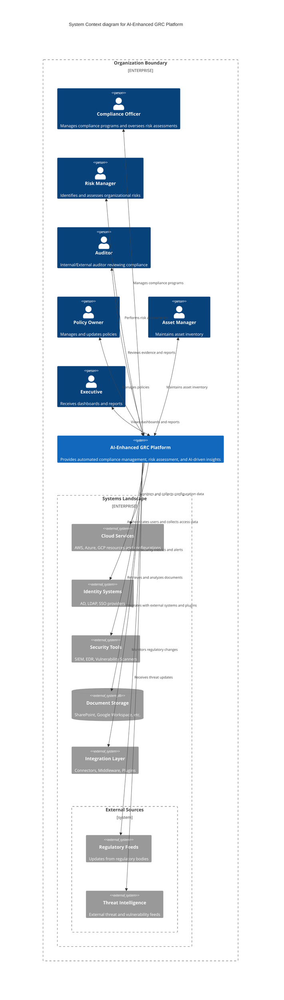
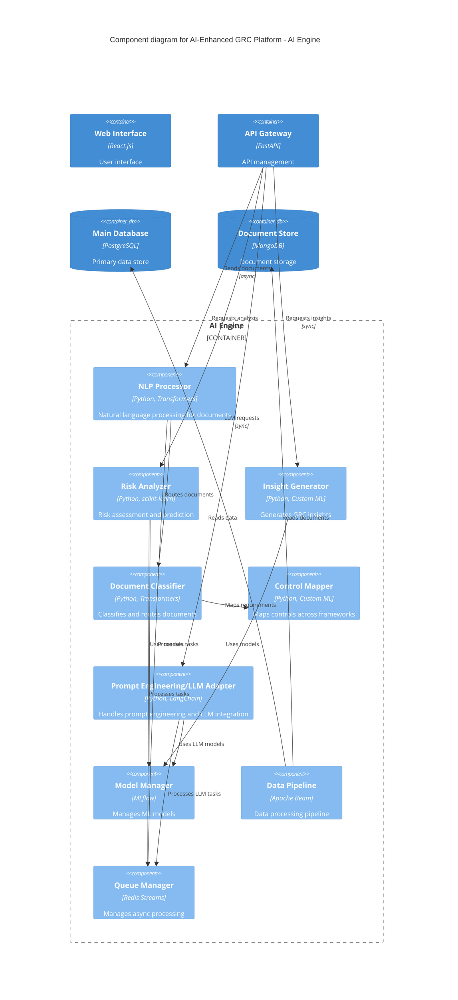

# GRC Platform Architecture

## System Context Diagram

```mermaid
C4Context
    title System Context diagram for AI-Enhanced GRC Platform

    Enterprise_Boundary(b0, "Organization Boundary") {
        Person(compliance_officer, "Compliance Officer", "Manages compliance programs and oversees risk assessments")
        Person(risk_manager, "Risk Manager", "Identifies and assesses organizational risks")
        Person(auditor, "Auditor", "Internal/External auditor reviewing compliance")
        Person(policy_owner, "Policy Owner", "Manages and updates policies")
        Person(asset_manager, "Asset Manager", "Maintains asset inventory")
        Person(executive, "Executive", "Receives dashboards and reports")
        
        System(grc_system, "AI-Enhanced GRC Platform", "Provides automated compliance management, risk assessment, and AI-driven insights")

        Enterprise_Boundary(b1, "Systems Landscape") {
            System_Ext(cloud_services, "Cloud Services", "AWS, Azure, GCP resources and configurations")
            System_Ext(identity_system, "Identity Systems", "AD, LDAP, SSO providers")
            System_Ext(security_tools, "Security Tools", "SIEM, EDR, Vulnerability Scanners")
            SystemDb_Ext(doc_storage, "Document Storage", "SharePoint, Google Workspace, etc.")
            System_Ext(integration_layer, "Integration Layer", "Connectors, Middleware, Plugins")
            
            Boundary(b2, "External Sources") {
                System_Ext(regulatory_feeds, "Regulatory Feeds", "Updates from regulatory bodies")
                System_Ext(threat_feeds, "Threat Intelligence", "External threat and vulnerability feeds")
            }
        }
    }

    BiRel(compliance_officer, grc_system, "Manages compliance programs")
    BiRel(risk_manager, grc_system, "Performs risk assessments")
    BiRel(auditor, grc_system, "Reviews evidence and reports")
    BiRel(policy_owner, grc_system, "Manages policies")
    BiRel(asset_manager, grc_system, "Maintains asset inventory")
    BiRel(executive, grc_system, "Views dashboards and reports")
    
    Rel(grc_system, cloud_services, "Monitors and collects configuration data")
    Rel(grc_system, identity_system, "Authenticates users and collects access data")
    Rel(grc_system, security_tools, "Collects security metrics and alerts")
    Rel(grc_system, doc_storage, "Retrieves and analyzes documents")
    Rel(grc_system, regulatory_feeds, "Monitors regulatory changes")
    Rel(grc_system, threat_feeds, "Receives threat updates")
    Rel(grc_system, integration_layer, "Integrates with external systems and plugins")

    UpdateLayoutConfig($c4ShapeInRow="3", $c4BoundaryInRow="1")
```

## Container Diagram

```mermaid
C4Container
    title Container diagram for AI-Enhanced GRC Platform

    Person(compliance_officer, "Compliance Officer", "Manages compliance programs")
    Person(risk_manager, "Risk Manager", "Assesses risks")
    Person(auditor, "Auditor", "Reviews compliance")
    Person(policy_owner, "Policy Owner", "Manages policies")
    Person(asset_manager, "Asset Manager", "Maintains asset inventory")
    Person(executive, "Executive", "Receives dashboards and reports")

    System_Ext(external_systems, "External Systems", "Cloud Services, Security Tools, etc.")
    System_Ext(integration_layer, "Integration Layer", "Connectors, Middleware, Plugins")

    Container_Boundary(c1, "AI-Enhanced GRC Platform") {
        Container(web_ui, "Web Interface", "React.js, TypeScript", "Modern web interface for GRC management")
        Container(api_gateway, "API Gateway", "Python FastAPI", "Handles API routing and authentication")
        Container(ai_engine, "AI Engine", "Python, TensorFlow", "Processes data and generates insights")
        Container(compliance_service, "Compliance Service", "Python", "Manages compliance frameworks and assessments")
        Container(risk_service, "Risk Service", "Python", "Handles risk assessments and analysis")
        Container(evidence_service, "Evidence Collection Service", "Python", "Automated evidence gathering and processing")
        Container(policy_service, "Policy Management Service", "Python", "Manages policies and policy lifecycle")
        Container(asset_service, "Asset Inventory Service", "Python", "Tracks and manages assets")
        Container(workflow_service, "Workflow/Task Service", "Python", "Manages tasks, workflows, and assignments")
        Container(reporting_service, "Reporting & Dashboard Service", "Python", "Generates reports and dashboards")
        Container(plugin_manager, "Plugin/Extension Manager", "Python", "Handles extensibility and integrations")
        ContainerDb(main_db, "Main Database", "PostgreSQL", "Stores GRC data")
        ContainerDb(document_store, "Document Store", "MongoDB", "Stores unstructured data and documents")
        ContainerQueue(event_bus, "Event Bus", "Redis", "Handles async communication between services")
        Container(ml_pipeline, "ML Pipeline", "Python, Apache Airflow", "Manages ML model training and updates")
    }

    Rel(compliance_officer, web_ui, "Uses", "HTTPS")
    Rel(risk_manager, web_ui, "Uses", "HTTPS")
    Rel(auditor, web_ui, "Uses", "HTTPS")
    Rel(policy_owner, web_ui, "Uses", "HTTPS")
    Rel(asset_manager, web_ui, "Uses", "HTTPS")
    Rel(executive, web_ui, "Views dashboards", "HTTPS")

    Rel(web_ui, api_gateway, "Makes API calls to", "JSON/HTTPS")
    Rel(api_gateway, compliance_service, "Routes compliance requests")
    Rel(api_gateway, risk_service, "Routes risk management requests")
    Rel(api_gateway, evidence_service, "Routes evidence collection requests")
    Rel(api_gateway, policy_service, "Routes policy management requests")
    Rel(api_gateway, asset_service, "Routes asset inventory requests")
    Rel(api_gateway, workflow_service, "Routes workflow requests")
    Rel(api_gateway, reporting_service, "Routes reporting requests")
    Rel(api_gateway, plugin_manager, "Routes plugin/extension requests")

    Rel(compliance_service, ai_engine, "Requests analysis")
    Rel(risk_service, ai_engine, "Requests predictions")
    Rel(evidence_service, ai_engine, "Requests document processing")
    Rel(policy_service, ai_engine, "Requests policy insights")
    Rel(asset_service, ai_engine, "Requests asset analysis")

    Rel_Back(main_db, compliance_service, "Reads/Writes")
    Rel_Back(main_db, risk_service, "Reads/Writes")
    Rel_Back(main_db, policy_service, "Reads/Writes")
    Rel_Back(main_db, asset_service, "Reads/Writes")
    Rel_Back(main_db, workflow_service, "Reads/Writes")
    Rel_Back(main_db, reporting_service, "Reads/Writes")
    Rel_Back(document_store, evidence_service, "Reads/Writes")
    Rel_Back(document_store, policy_service, "Reads/Writes")
    Rel_Back(document_store, asset_service, "Reads/Writes")
    Rel(evidence_service, external_systems, "Collects data", "API")
    Rel(plugin_manager, integration_layer, "Loads plugins and connectors")
    BiRel(ai_engine, ml_pipeline, "Model updates")
    BiRel(event_bus, ai_engine, "Events")
    BiRel(plugin_manager, event_bus, "Plugin events")

    UpdateLayoutConfig($c4ShapeInRow="4", $c4BoundaryInRow="1")
```

## Component Diagram

```mermaid
C4Component
    title Component diagram for AI-Enhanced GRC Platform - AI Engine

    Container(web_ui, "Web Interface", "React.js", "User interface")
    Container(api_gateway, "API Gateway", "FastAPI", "API management")
    ContainerDb(main_db, "Main Database", "PostgreSQL", "Primary data store")
    ContainerDb(doc_store, "Document Store", "MongoDB", "Document storage")

    Container_Boundary(ai_engine, "AI Engine") {
        Component(nlp_processor, "NLP Processor", "Python, Transformers", "Natural language processing for documents")
        Component(risk_analyzer, "Risk Analyzer", "Python, scikit-learn", "Risk assessment and prediction")
        Component(insight_generator, "Insight Generator", "Python, Custom ML", "Generates GRC insights")
        Component(doc_classifier, "Document Classifier", "Python, Transformers", "Classifies and routes documents")
        Component(control_mapper, "Control Mapper", "Python, Custom ML", "Maps controls across frameworks")
        Component(prompt_engineering, "Prompt Engineering/LLM Adapter", "Python, LangChain", "Handles prompt engineering and LLM integration")
        Component(model_manager, "Model Manager", "MLflow", "Manages ML models")
        Component(data_pipeline, "Data Pipeline", "Apache Beam", "Data processing pipeline")
        Component(queue_manager, "Queue Manager", "Redis Streams", "Manages async processing")
    }

    Rel(api_gateway, nlp_processor, "Sends documents", "async")
    Rel(api_gateway, risk_analyzer, "Requests analysis", "sync")
    Rel(api_gateway, insight_generator, "Requests insights", "sync")
    Rel(api_gateway, prompt_engineering, "LLM requests", "sync")
    Rel(nlp_processor, doc_classifier, "Routes documents")
    Rel(doc_classifier, control_mapper, "Maps requirements")
    Rel(risk_analyzer, model_manager, "Uses models")
    Rel(insight_generator, model_manager, "Uses models")
    Rel(prompt_engineering, model_manager, "Uses LLM models")
    Rel(data_pipeline, main_db, "Reads data")
    Rel(data_pipeline, doc_store, "Reads documents")
    Rel_Back(queue_manager, nlp_processor, "Processes tasks")
    Rel_Back(queue_manager, risk_analyzer, "Processes tasks")
    Rel_Back(queue_manager, prompt_engineering, "Processes LLM tasks")
    UpdateLayoutConfig($c4ShapeInRow="4", $c4BoundaryInRow="1")
```

---

**Alignment with Functional Coverage & ciso-assistant Baseline**

- All core modules from the functional coverage analysis are now represented as containers/services (Compliance, Risk, Evidence, Policy, Asset, Workflow, Reporting, Plugin/Extension).
- AI Engine is extensible for new models, LLMs, and prompt engineering.
- Plugin/Extension Manager and Integration Layer support extensibility and future connectors.
- User roles and external systems are expanded for broader coverage.
- Naming and structure are aligned with ciso-assistant recommendations.

*This architecture is designed for extensibility, modularity, and AI-driven automation, and is suitable as a baseline for open-source GRC platform development.*
