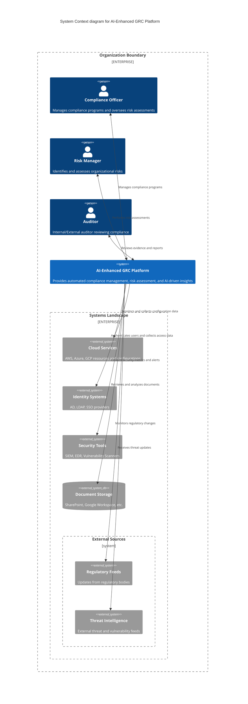
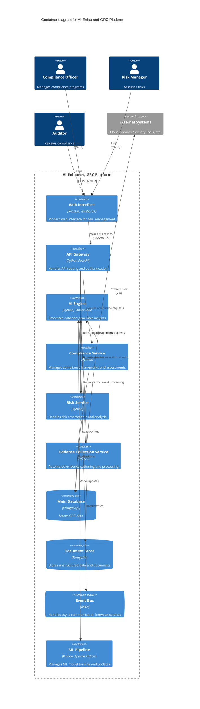
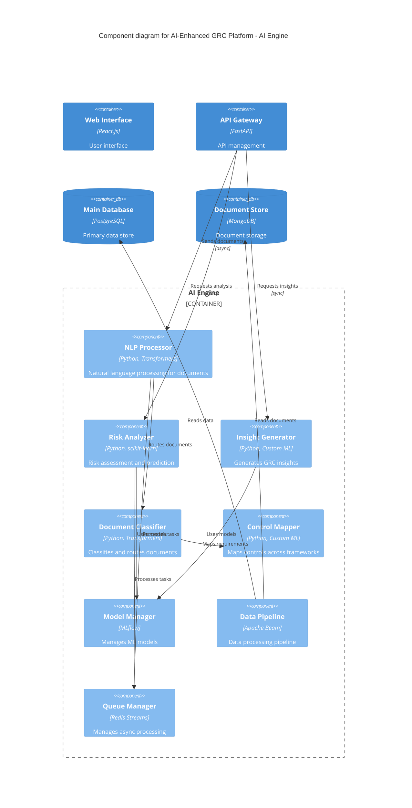

# GRC Platform Architecture

## System Context Diagram

## Container Diagram

## Component Diagram

The architecture presented above shows a modern, microservices-based GRC platform with integrated AI capabilities. Here's a brief explanation of each diagram:

1. **System Context Diagram**:
   - Shows how the platform interacts with external systems and users
   - Highlights data collection from various sources
   - Demonstrates the broad scope of automation

2. **Container Diagram**:
   - Details the major services and their interactions
   - Shows the separation of concerns between different components
   - Highlights how AI is integrated throughout the system

3. **Component Diagram (AI Engine Focus)**:
   - Detailed view of the AI Engine internals
   - Shows how different ML models work together
   - Demonstrates data processing flow

Key architectural decisions:

1. **Microservices Architecture**:
   - Each major function is a separate service
   - Services communicate via API Gateway
   - Event-driven architecture for async operations

2. **AI Integration**:
   - Centralized AI Engine for reusable ML capabilities
   - Separate ML Pipeline for model training
   - Multiple specialized ML components for different tasks

3. **Scalability & Performance**:
   - Event bus for async operations
   - Separate databases for structured and unstructured data
   - Containerized deployment support

4. **Security & Compliance**:
   - API Gateway for centralized security
   - Separate services for better access control
   - Audit-friendly architecture
