# GRCEEK - Business Requirements Document

**Document Control**

- **Title**: Business Requirements Document
- **Project Name**: GRCEEK
- **Date**: 3 June 2023
- **Author**: Ahmed Alaa
- **Version**: V1.0

| Version No | Date       | Modification Description | Prepared By | Verified By | Approved By |
|------------|------------|--------------------------|-------------|-------------|-------------|
| 1.0        | 3 June 2023 | Create the document      | Ahmed Alaa  |             |             |

> **Confidentiality Notice**: This document contains confidential and proprietary information belonging to Fixed Solution. Unauthorized disclosure, copying, or distribution is strictly prohibited.

## Table of Contents
1. [Executive Summary](#executive-summary)
2. [Project Overview](#project-overview)
3. [Mission, Vision, Goals, and Business Needs](#mission-vision-goals-and-business-needs)
4. [Scope of the Document](#scope-of-the-document)
5. [Functional Requirements](#functional-requirements)
   - [User Management](#user-management)
   - [Incident Reporting](#incident-reporting)
   - [Framework Management](#framework-management)
   - [Risk Management](#risk-management)
   - [Control Management](#control-management)
   - [Policy Management](#policy-management)
   - [Workflow Configuration](#workflow-configuration)
   - [Customer Reports](#customer-reports)
   - [Framework Score Calculation](#framework-score-calculation)
   - [Auditor Functionalities](#auditor-functionalities)
   - [System Configuration](#system-configuration)
   - [Roles and Permissions](#roles-and-permissions)
   - [Notification](#notification)
6. [List of Actors](#list-of-actors)
7. [Non-Functional Requirements](#non-functional-requirements)
8. [Assumptions](#assumptions)
9. [Constraints](#constraints)
10. [Glossary and Acronyms](#glossary-and-acronyms)
11. [Conclusion](#conclusion)
12. [MVP Scope](#mvp-scope)
13. [Need for Further Investigation](#need-for-further-investigation)
14. [Competitor Analysis](#competitor-analysis)
15. [Next Steps](#next-steps)

## Executive Summary

The Governance, Risk, and Compliance (GRC) system is a web-based platform to enhance organizational governance, risk management, policy enforcement, and compliance. It includes modules for User Management, Incident Reporting, Framework Management, Risk Management, Control Management, Policy Management, Workflow Configuration, and Reporting/Dashboards. Features include auditor roles, framework score calculations, and automated workflows for seamless, secure operations.

## Project Overview
### Project Description

The GRC system is a web-based platform for secure governance, risk management, policy enforcement, and compliance. It supports global users (Compliance Officers, Auditors, Admins) with features like secure user management, framework management (ISO 27001, NIST, GDPR), policy enforcement, auditor workflows, and compliance reporting.

## Mission, Vision, Goals, and Business Needs
### Mission

Transform organizational governance, risk management, and compliance with a secure, user-friendly platform for managing frameworks, policies, and compliance.

### Vision

Become the leading global GRC platform, enhancing compliance, risk, and policy management with advanced technology and exceptional user experience.

### Goals
- **User-Centric Experience**: Streamlined workflows for users (Compliance Officers, Auditors, Admins).
- **Operational Efficiency**: Optimize framework, policy, control, and risk management with robust reporting.
- **Security and Compliance**: Ensure data security, privacy, and adherence to standards (ISO 27001, NIST, GDPR, COSO).
- **Organizational Trust**: Foster trust through auditor workflows, accurate scoring, and transparent reporting.

## Scope of the Document

- User registration, authentication, and profile management with RBAC.
- Secure compliance via framework management (ISO 27001, NIST, GDPR, COSO) and policy enforcement.
- Incident Management: Track and resolve incidents with evidence uploads.
- Risk Management: Assess and mitigate risks with likelihood/impact scoring.
- Control Management: Implement and test controls with effectiveness ratings.
- Policy Management: Create, enforce, and review policies linked to frameworks/controls.
- Notifications: Template-based (e.g., incident submitted) and role-based (e.g., all Risk Management actions) via email or in-website.
- Reporting: Real-time reports and dashboards with filtering and export options (CSV).

## Functional Requirements

### User Management

**Purpose**: Manage user accounts and roles with RBAC, enabling Admins to create accounts or send role-specific invitation links.

**Features**:
- Admins send invitation links via email or copied links.
- Enforce strong passwords (8+ characters, uppercase, lowercase, numbers, special characters).
- Track interactions for auditability; retain deactivated user names in records.

**User Completion Form (Via Invitation Link or Admin Creation)**

| Field           | Description                     | Validation                              |
|-----------------|---------------------------------|-----------------------------------------|
| User ID         | Unique alphanumeric ID (USER123) | Auto-generated, non-editable            |
| Name            | Full name                       | Required, text, min 5, max 100 chars    |
| Email           | User email                      | Required, valid email, unique            |
| Password        | Initial or user-entered password | Required, 8+ chars, mixed types         |
| Confirm Password| Password confirmation           | Required, must match Password           |
| Role            | Predefined/custom role          | Required, dropdown, Admin-editable only |
| Department      | User department                 | Optional, text, max 50 chars            |
| Status          | Account status                  | Auto-set (Pending/Active/Inactive)      |

**Admin Invitation Form**

| Field | Description               | Validation                       |
|-------|---------------------------|----------------------------------|
| Email | User's email for invitation | Required, valid email, unique    |
| Role  | Predefined role           | Required, dropdown               |

**Workflow**:
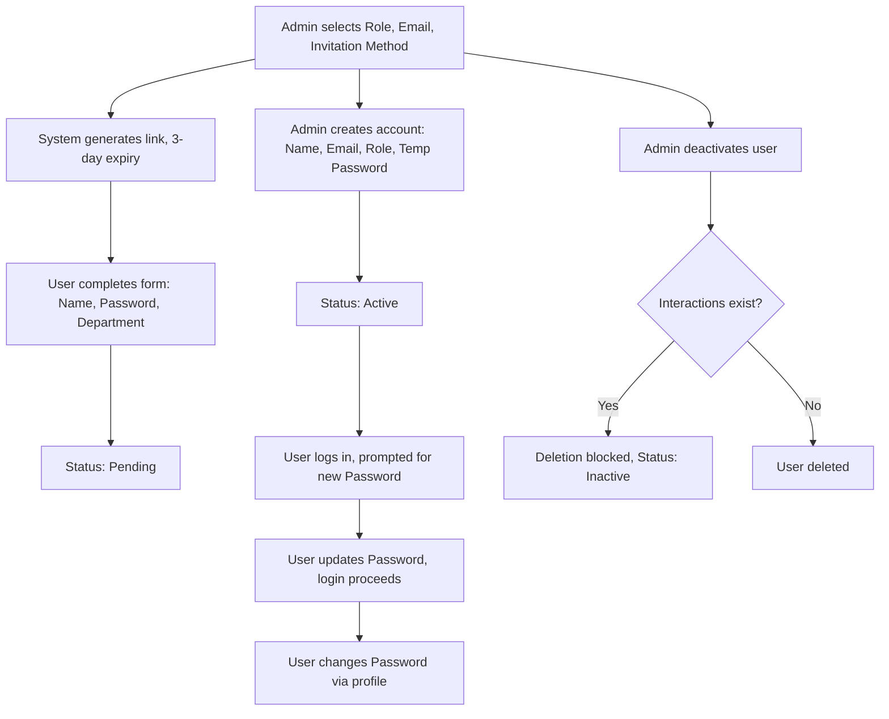

### Incident Reporting

**Purpose**: Track and resolve compliance incidents with evidence and status tracking.

**Features**:
- CRUD incident reports.
- Incident Managers review, accept/reject incidents, assign Owners.
- Upload evidence (PDFs, images, MP4, max 10MB).
- Track status with admin approvals.

**Create Form Fields**

| Field           | Description                     | Validation                              |
|-----------------|---------------------------------|-----------------------------------------|
| Incident ID     | Unique ID (INC123)              | Auto-generated, non-editable            |
| Title           | Brief description               | Required, text, min 5, max 100 chars    |
| Description     | Detailed explanation            | Required, text, max 1000 chars          |
| Category        | Type (e.g., Security)           | Required, dropdown                      |
| Date Identified | Incident date                   | Required, MM/DD/YYYY, not future        |
| Submitter       | Reporter's name                 | Auto-filled, non-editable               |
| Evidence        | File uploads (PDF, JPG, PNG, MP4) | Required, max 10MB                     |

**Workflow**:
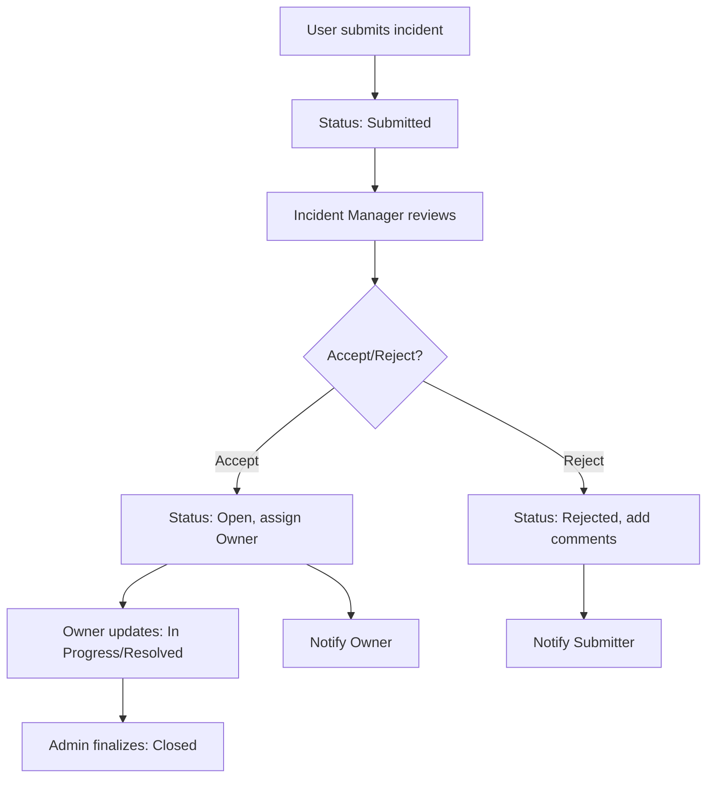

### Framework Management

**Purpose**: Define and manage compliance frameworks (e.g., ISO 27001) with scoring and auditor oversight.

**Features**:
- CRUD frameworks.
- Link controls, calculate scores (automatic/manual).
- Link policies, allow auditor comments.
- Track framework status.

**Create Form Fields**

| Field             | Description                     | Validation                              |
|-------------------|---------------------------------|-----------------------------------------|
| Framework ID      | Unique ID (FRM123)              | Auto-generated, non-editable            |
| Name              | Framework name (e.g., ISO 27001)| Required, text, min 5, max 100 chars, unique |
| Description       | Overview                        | Required, text, min 5, max 1000 chars   |
| Controls          | Associated controls             | Required, dropdown/search, min 1        |
| Policies          | Associated policies             | Required, dropdown/search, min 1        |
| Scoring Method    | Automatic/Manual                | Required, dropdown                      |
| Framework Score   | Total score (0-100)             | 0-100 only                              |
| Owner             | Responsible user                | Required, dropdown/search               |
| Standard Reference| Details (e.g., ISO 27001:2022) | Optional, text, max 200 chars           |
| Compliance Deadline | Compliance date               | Required, MM/DD/YYYY, not past         |
| Status            | Current status (Active)         | Required, dropdown, default Active      |

**Workflow**:
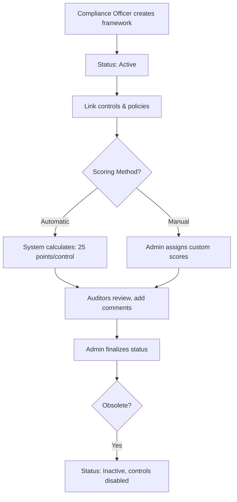

### Risk Management

**Purpose**: Identify, assess, and mitigate risks with scoring and status tracking.

**Features**:
- CRUD risks.
- Calculate scores (Likelihood × Impact).
- Assign risks to owners.
- Track status with admin-approved workflows.

**Create Form Fields**

| Field       | Description                     | Validation                              |
|-------------|---------------------------------|-----------------------------------------|
| Risk ID     | Unique ID (RISK123)             | Auto-generated, non-editable            |
| Title       | Risk description                | Required, text, min 5, max 200 chars    |
| Description | Detailed explanation            | Required, text, min 5, max 1000 chars   |
| Category    | Type (e.g., Cybersecurity)      | Required, dropdown                      |
| Likelihood  | Probability (Rare to Certain)   | Required, dropdown, maps to 1-5         |
| Impact      | Consequence (Minor to Catastrophic) | Required, dropdown, maps to 1-4     |

**Workflow**:
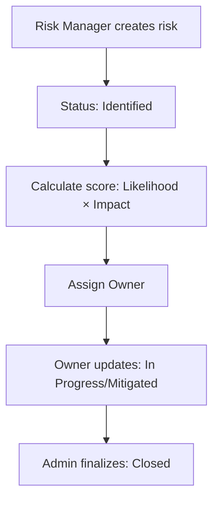

### Control Management

**Purpose**: Implement and test controls to mitigate risks and ensure compliance.

**Features**:
- CRUD controls.
- Assign controls to owners.
- Rate effectiveness (High, Medium, Low).
- Allow auditor comments.

**Create Form Fields**

| Field           | Description                     | Validation                              |
|-----------------|---------------------------------|-----------------------------------------|
| Control ID      | Unique ID (CTRL123)             | Auto-generated, non-editable            |
| Title           | Control description             | Required, text, min 5, max 100 chars    |
| Description     | Detailed explanation            | Required, text, min 5, max 1000 chars   |
| Category        | Type (e.g., Preventive)         | Required, dropdown                      |
| Assigned To     | Responsible user                | Required, dropdown/search               |
| Related Risk    | Linked risk                    | Optional, dropdown/search               |
| Related Framework | Associated framework          | Required, dropdown/search               |
| Status          | Current status (Draft)          | Auto-set, non-editable on creation      |
| Effectiveness   | Rating (High, Medium, Low)      | Optional, dropdown                      |

**Workflow**:
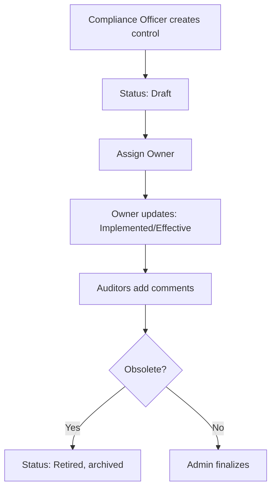

### Policy Management

**Purpose**: Create, enforce, and review policies linked to frameworks/controls.

**Features**:
- CRUD policies.
- Link policies to frameworks/controls.
- Track lifecycle with status workflows.
- Allow auditor comments.

**Create Form Fields**

| Field           | Description                     | Validation                              |
|-----------------|---------------------------------|-----------------------------------------|
| Policy ID       | Unique ID (POL123)              | Auto-generated, non-editable            |
| Title           | Policy title (e.g., Data Protection) | Required, text, min 5, max 100 chars |
| Description     | Detailed explanation            | Optional, text, max 2000 chars          |
| Category        | Type (e.g., Security)           | Required, dropdown                      |
| Owner           | Responsible user                | Required, dropdown/search               |
| Related Framework | Linked framework             | Required, dropdown/search               |
| Related Controls | Linked controls                | Optional, dropdown/search               |
| Policy Document | File uploads (PDF, JPG, PNG)   | Required, max 10MB                     |
| Effective Date  | Policy start date               | Required, MM/DD/YYYY, not past         |
| Status          | Current status (Draft)          | Auto-set, non-editable on creation      |

**Workflow**:
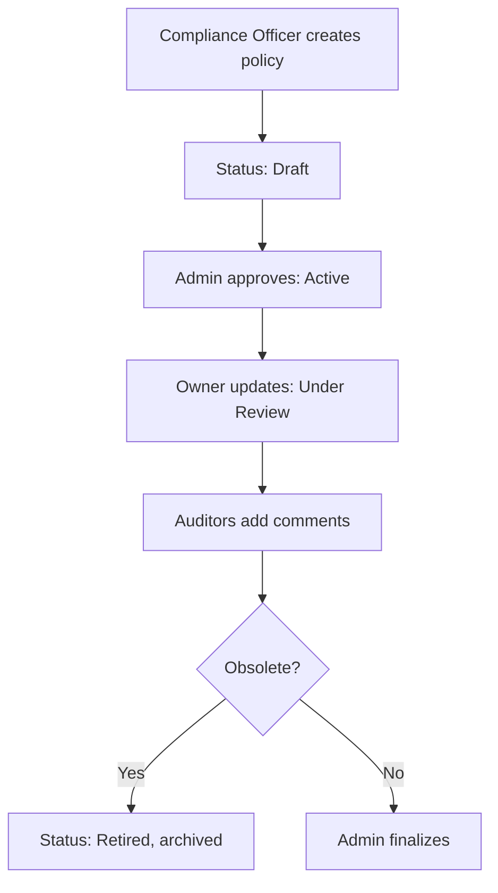

### Workflow Configuration

**Purpose**: Design automated workflows for status transitions across modules.

**Features**:
- CRUD workflows.
- Define steps, roles, status changes.
- Enable drag-and-drop configuration.

**Create Form Fields**

| Field       | Description                     | Validation                              |
|-------------|---------------------------------|-----------------------------------------|
| Workflow ID | Unique ID (WF123)               | Auto-generated, non-editable            |
| Name        | Workflow name                   | Required, text, min 5, max 100 chars    |
| Steps       | Workflow steps (e.g., Draft, Review) | Required, min 1 step, text/drag-and-drop |
| Assigned Roles | Roles per step                | Required, dropdown/search (multi-select) |
| Type        | Default or Custom               | Required, dropdown                      |
| Linked Item | Policy/Control/Framework/Risk   | Optional, required for Custom           |

**Workflow**:
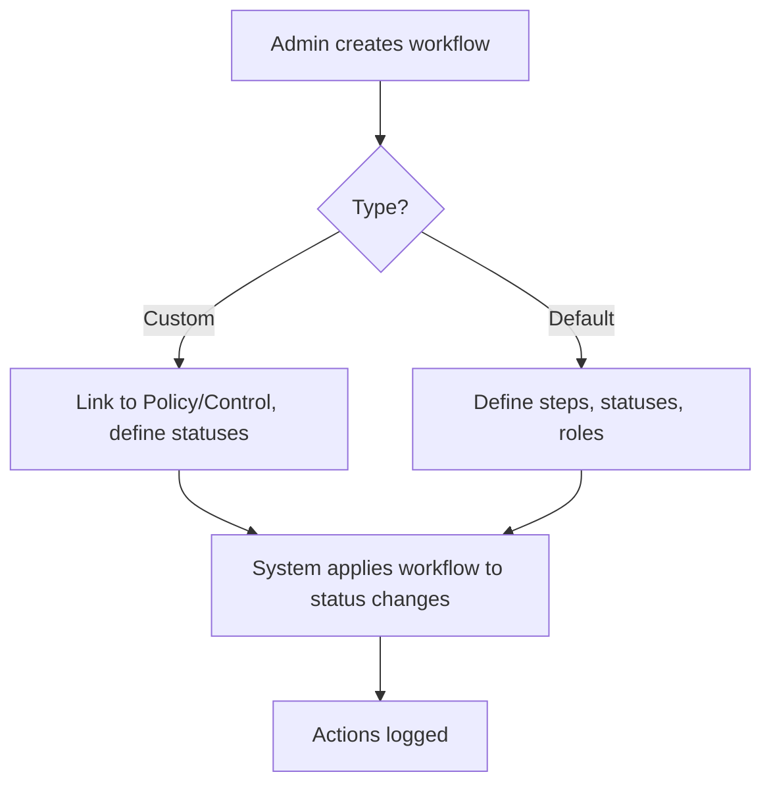

### Customer Reports

**Purpose**: Generate and visualize compliance reports and metrics.

**Features**:
- CRUD reports/dashboards.
- Export in PDF/CSV.
- Display real-time metrics (e.g., framework scores).

**Create Form Fields**

| Field   | Description                     | Validation                              |
|---------|---------------------------------|-----------------------------------------|
| Report ID | Unique ID (RPT123)             | Auto-generated, non-editable            |
| Title     | Report title                   | Required, text, min 5, max 100 chars    |
| Type      | Report type (e.g., Risk)       | Required, dropdown                      |
| Filters   | Parameters (e.g., control status) | Required, dropdown                    |

**Workflow**:
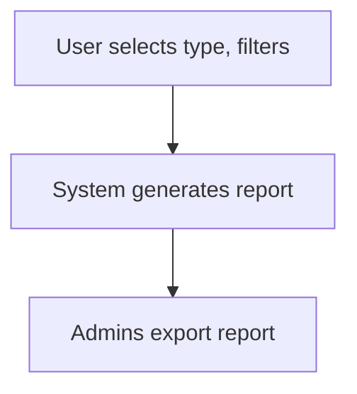

### Framework Score Calculation

**Purpose**: Calculate compliance scores for frameworks based on control effectiveness.

**Features**:
- Automatic Scoring: 100 points divided across controls (e.g., 4 controls = 25 points each; High: 100%, Medium: 50%, Low: 0).
- Manual Scoring: Admins assign custom scores, capped at 100.
- Validation: Requires at least one control.

**Workflow**:
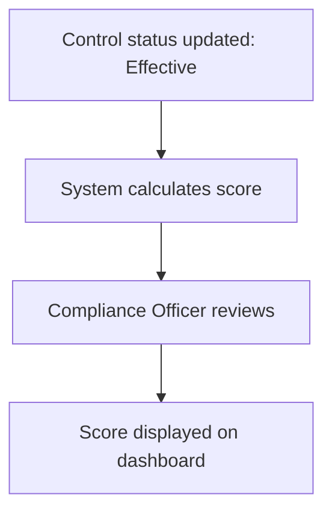

### Auditor Functionalities

**Purpose**: Enable auditors to review and comment on frameworks, controls, and policies.

**Features**:
- Read-only access to frameworks, controls, policies, workflows.
- Add comments (max 1000 characters).
- View compliance reports and scores.

**Workflow**:
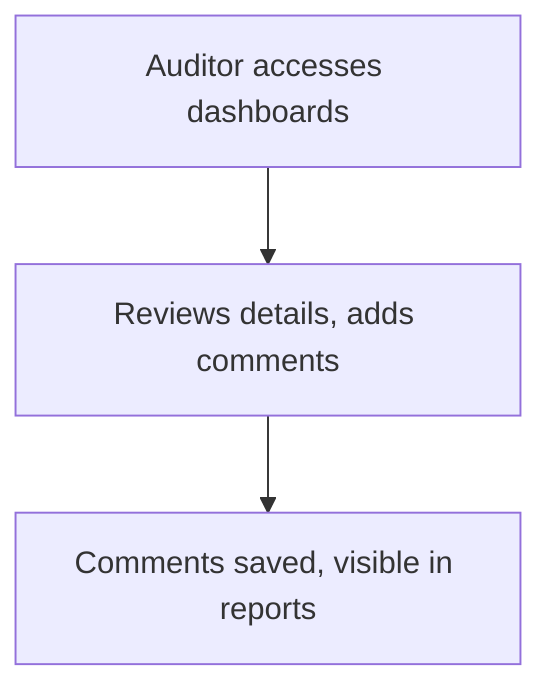

### System Configuration

**Purpose**: Manage system-wide settings, including categories for modules.

**Features**:
- CRUD categories (e.g., Risk: Operational).
- Enforce unique category names.
- Audit configuration changes.
- Notify Admins of updates.

**Create Form Fields**

| Field         | Description                     | Validation                              |
|---------------|---------------------------------|-----------------------------------------|
| Category ID   | Unique ID (CAT123)              | Auto-generated, non-editable            |
| Category Name | Category name                   | Required, text, min 5, max 100 chars, unique |
| Module        | Associated module (e.g., Risk)  | Required, dropdown                      |
| Description   | Category details                | Optional, text, max 500 chars           |
| Status        | Active/Inactive                 | Required, dropdown, default Active      |

**Workflow**:
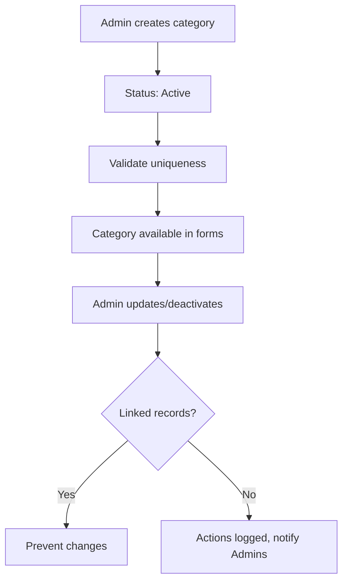

### Roles and Permissions

**Purpose**: Define and manage roles with granular permissions for modules.

**Features**:
- CRUD roles (e.g., Admin, Auditor).
- Assign permissions per module (e.g., Risk: CRUD).
- Enforce permission validation.
- Audit role/permission changes.
- Notify Admins of updates.

**Create Form Fields**

| Field            | Description                     | Validation                              |
|------------------|---------------------------------|-----------------------------------------|
| Role ID          | Unique ID (ROLE123)             | Auto-generated, non-editable            |
| Role Name        | Role name (e.g., Compliance Officer) | Required, text, min 5, max 100 chars, unique |
| Description      | Role details                    | Optional, text, max 500 chars           |
| Permissions      | Module-specific access          | Required, checkbox list per module      |
| Notification Receive | Notification settings         | Checkbox for modules                    |
| Status           | Active/Inactive                 | Required, dropdown, default Active      |

**Workflow**:
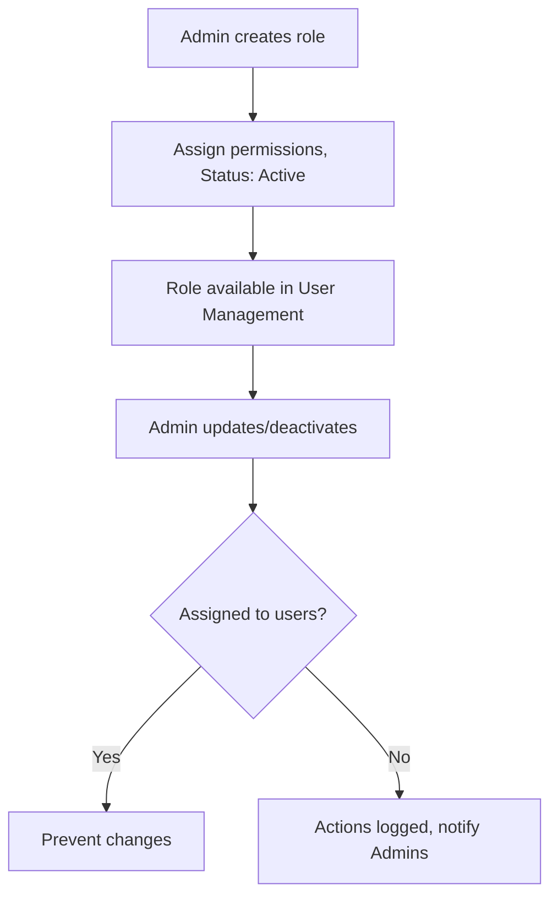

### Notification

**Purpose**: Manage automated notifications (email/in-website) for events via template-based or role-based methods.

**Features**:
- Template-Based: CRUD templates for specific events (e.g., incident submitted).
- Role-Based: Notifications for all actions in configured modules.
- Support email and in-website delivery.
- Audit triggers and deliveries.

**Create Form Fields (Notification Template)**

| Field         | Description                     | Validation                              |
|---------------|---------------------------------|-----------------------------------------|
| Template ID   | Unique ID (NOTIF123)            | Auto-generated, non-editable            |
| Template Name | Name (e.g., Incident Submitted) | Required, text, min 5, max 100 chars    |
| Event Type    | Trigger event (e.g., Incident Status Change) | Required, dropdown                  |
| Delivery Method | Email, In-App, or Both        | Required, dropdown                      |
| Recipients    | Roles or users                  | Required, dropdown/search               |
| Message Title | Notification title              | Required, text, min 5, max 100 chars    |
| Message Body  | Notification content            | Required, text, min 5, max 1000 chars   |
| Status        | Active/Inactive                 | Required, dropdown, default Active      |

**Workflow**:
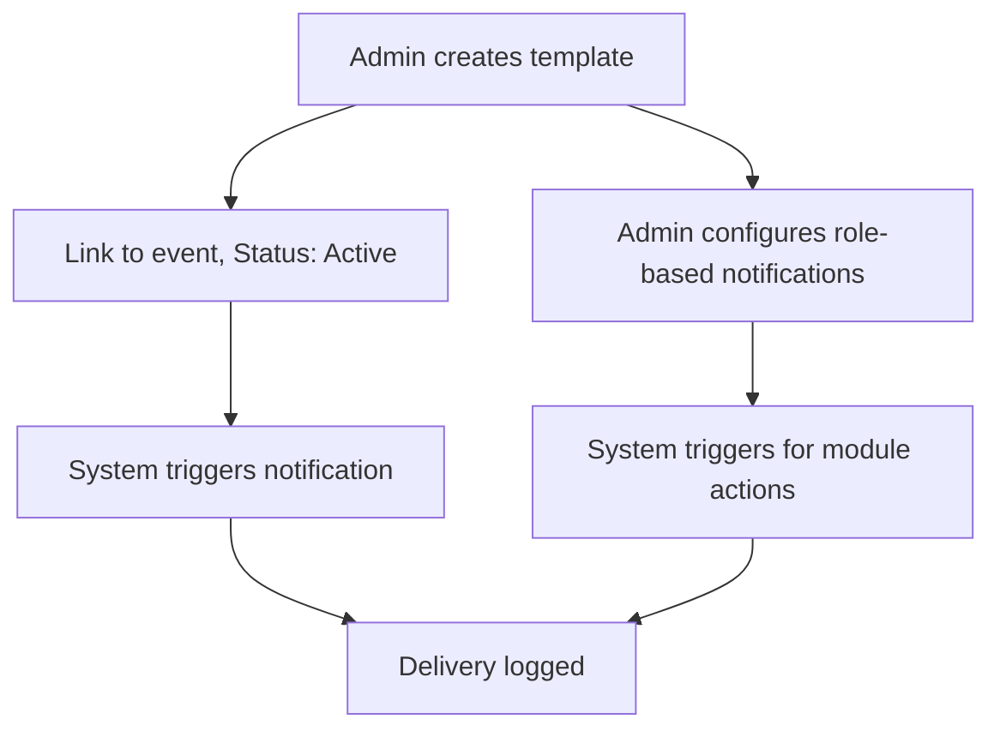

## List of Actors
### End Users
- **Compliance Officer**: Manages policies, controls, frameworks; links controls to risks/frameworks; reviews scores.
- **Risk Manager**: Identifies, assesses, mitigates risks; calculates scores; updates statuses.
- **Incident Submitter**: Submits incident reports with evidence; receives notifications.
- **Control Owner**: Implements/tests controls; rates effectiveness; updates statuses.
- **Policy Owner**: Prepares/enforces/reviews policies; links to frameworks/controls.
- **Framework Owner**: Creates/manages frameworks; links controls; reviews scores.

### Back-Office Users
- **Admin**: Manages users, roles, configurations, workflows; approves status changes.
- **Incident Manager**: Reviews/accepts/rejects incidents; assigns owners.
- **Internal Auditor**: Reviews frameworks/controls/policies; adds comments; approves/rejects.
- **External Auditor**: Independent reviews; adds comments; approves/rejects.
- **System Configurator**: Manages categories for modules; configures notifications.
- **Role Manager**: Creates/manages roles and permissions; configures notifications.
- **Notification Manager**: Manages notification templates; monitors delivery logs.
- **Report Generator**: Generates/exports reports/dashboards; filters by categories.

### External Systems
- **Email Service Provider**: Delivers email notifications for events and role-based actions.

## Non-Functional Requirements
### Performance

- Response Time: <4 seconds for page loads.
- Throughput: Handle 1,000 concurrent sessions.
- Notification Delivery: <10 seconds.

### Security

- Data Encryption: Encrypt all data at rest.
- Authentication: Strong passwords (8+ chars, mixed types).
- Authorization: RBAC for access control.
- Audit Logging: Log all user actions with timestamps.

### Usability

- UI: Responsive, compatible with modern browsers/devices.
- Accessibility: WCAG 2.1 Level AA compliant.
- Localization: English primary language.
- Error Handling: Clear, user-friendly error messages.

### Availability

- Uptime: 95% (excluding maintenance).
- Maintenance: Outside peak hours, 24-hour notice.
- Disaster Recovery: RTO ≤ 4 hours.

### Maintainability

- Code Quality: Follow clean code principles.
- Documentation: Include API specs, architecture diagrams, user manuals.

## Assumptions
- Users have modern browsers and reliable internet.
- Stakeholders (e.g., Compliance Officers) are available.
- Cloud or on-prem infrastructure provided.
- Third-party services (e.g., Email Provider) have 99.9% uptime.

## Constraints
- Budget: Align with allocated funds.
- Timeline: Deliver within agreed schedule.
- Technology: Use approved technologies; ensure legacy compatibility.
- User Adoption: Varying proficiency requires simple UI, training.

## Glossary and Acronyms
### Acronyms

- **BRD**: Business Requirements Document
- **CRUD**: Create, Read, Update, Delete
- **GRC**: Governance, Risk, and Compliance
- **ISO 27001**: Information security standard
- **ISO 31000**: Risk management standard
- **KPI**: Key Performance Indicator
- **MFA**: Multi-Factor Authentication
- **MVP**: Minimum Viable Product
- **RBAC**: Role-Based Access Control
- **RTO**: Recovery Time Objective
- **SSO**: Single Sign-On
- **UI**: User Interface
- **WCAG**: Web Content Accessibility Guidelines

### Glossary

- **Audit Log**: Record of all system actions.
- **Category**: Configurable classification for modules.
- **Compliance Officer**: Manages policies, controls, frameworks.
- **Control**: Measure to mitigate risks, rated High/Medium/Low.
- **Framework**: Compliance structure (e.g., ISO 27001), scored 0-100.
- **Incident**: Reported event with status cycle.
- **Notification**: Automated alerts (template-based or role-based).
- **Policy**: Documented rule with lifecycle.
- **Risk**: Potential issue scored as Likelihood × Impact.

## Conclusion

The GRC system streamlines governance, risk management, policy enforcement, and compliance with modules supporting global standards (ISO 27001, NIST, GDPR). It provides a secure, scalable, user-friendly solution.

## MVP Scope

- Secure user authentication with RBAC.
- Incident reporting with evidence upload.
- Risk assessment with control linkages.
- Policy/framework management with workflows.
- Automated notifications.
- Real-time reporting and audit trails.

## Need for Further Investigation

- **User Feedback**: Test usability with stakeholders.
- **Performance Benchmarking**: Stress test non-functional requirements.
- **Feature Expansion**: Explore AI-driven risk prediction, compliance gap analysis.

## Competitor Analysis

Analyze ServiceNow GRC, RSA Archer, MetricStream:
- Feature comparison.
- Pricing models.
- Market/customer needs.
- User reviews for pain points.

## Next Steps

1. Stakeholder Review: Distribute BRD for feedback.
2. MVP Development: Initiate core module development.
3. Competitor Analysis: Study ServiceNow, Archer, MetricStream.
```
