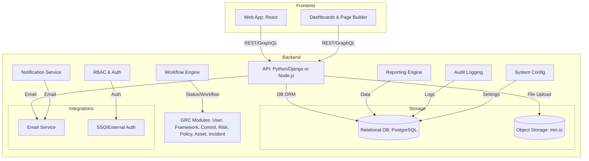

# GRCeek High-Level Architecture

This document provides a high-level architecture overview for the GRCeek platform, including key business requirements and a modern technical architecture.

---

## Business Requirements (from Release Scope)

- User Management with RBAC and invitation flows
- Framework, Control, Risk, Policy, and Asset Management (CRUD, linking, status workflows)
- Workflow Management (customizable, drag-and-drop)
- Custom Reports and real-time dashboards
- System Configurations (categories, settings)
- Roles & Permissions (granular, per module)
- Incident Reporting (lifecycle, evidence upload)
- Page Builder (custom UI/pages)
- Notifications (template-based, role-based, email/in-app)
- Security (encryption, RBAC, audit logging)
- Performance (<4s response, 1,000 users)
- Usability (responsive UI, accessibility)
- Availability (95% uptime, DR)
- Maintainability (clean code, docs)

---

## High-Level Architecture Diagram

---

*This architecture is designed for extensibility, modularity, and secure, scalable GRC operations aligned with business requirements.*
