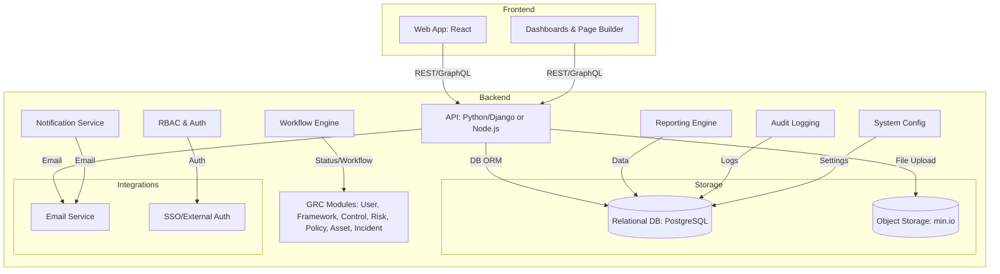

# GRCeek High-Level Architecture

This document provides a high-level architecture overview for the GRCeek platform, detailing key business requirements and the proposed technical architecture. It aims to offer a foundational understanding of the system's structure and components.

---

## 1. Business Requirements

The GRCeek platform is designed to meet a comprehensive set of business requirements, ensuring a robust, secure, and user-friendly experience for Governance, Risk, and Compliance (GRC) management.

- **User Management with RBAC and Invitation Flows:** The system must support the creation, modification, and deletion of user accounts. It will incorporate Role-Based Access Control (RBAC) to define user permissions and facilitate secure invitation flows for new users to join the platform.
- **Framework, Control, Risk, Policy, and Asset Management (CRUD, Linking, Status Workflows):** Core GRC entities will be managed within the system. This includes full Create, Read, Update, and Delete (CRUD) functionality for frameworks (e.g., ISO 27001, NIST), individual controls, identified risks, organizational policies, and critical assets. The system will enable linking these entities to demonstrate relationships and dependencies (e.g., a control mitigating a specific risk, a policy governing an asset). Furthermore, it will support customizable status workflows to track the lifecycle and approval processes of each entity.
- **Workflow Management (Customizable, Drag-and-Drop):** A flexible workflow engine is required to define and automate business processes related to GRC activities. Users should be able to design and modify workflows using an intuitive drag-and-drop interface, adapting them to specific organizational needs.
- **Custom Reports and Real-time Dashboards:** The platform will provide powerful reporting capabilities, allowing users to generate custom reports based on various GRC data points. Real-time dashboards will offer immediate insights into the organization's GRC posture, highlighting key metrics, compliance status, and risk exposure.
- **System Configurations (Categories, Settings):** Administrators will have the ability to configure various system-wide settings, including the definition of categories for different GRC entities (e.g., risk types, control families) and other operational parameters to tailor the platform to their environment.
- **Roles & Permissions (Granular, Per Module):** Beyond basic RBAC, the system will offer granular control over permissions, allowing administrators to define specific actions users can perform within each module (e.g., view only policies, edit risks, approve controls).
- **Incident Reporting (Lifecycle, Evidence Upload):** A dedicated module for incident management will support the full lifecycle of an incident, from initial reporting and categorization to investigation, resolution, and post-mortem analysis. It will facilitate the upload and attachment of evidence related to incidents.
- **Page Builder (Custom UI/Pages):** To enhance flexibility, a page builder feature will enable users to create custom user interfaces or pages within the platform, allowing for tailored views and data presentation without requiring code changes.
- **Notifications (Template-based, Role-based, Email/In-app):** The system will provide a robust notification mechanism to alert users about important events, workflow changes, or upcoming tasks. Notifications will be template-based for consistency and can be configured to be role-based, delivered via email, or as in-app messages.
- **Security (Encryption, RBAC, Audit Logging):** Security is paramount. The platform will implement data encryption at rest and in transit, enforce RBAC for access control, and maintain comprehensive audit logs of all user activities and system changes to ensure accountability and compliance.
- **Performance (<4s Response, 1,000 Users):** The system must be highly performant, with a target response time of less than 4 seconds for typical operations, even under a load of up to 1,000 concurrent users.
- **Usability (Responsive UI, Accessibility):** The user interface will be designed for optimal usability, featuring a responsive layout that adapts seamlessly to various devices (desktop, tablet, mobile) and adhering to accessibility standards to ensure inclusivity.
- **Availability (95% Uptime, DR):** The platform is expected to maintain a high level of availability, targeting 95% uptime. A disaster recovery (DR) strategy will be in place to ensure business continuity in the event of major disruptions.
- **Maintainability (Clean Code, Docs):** The codebase will be developed with maintainability in mind, following best practices for clean code, modular design, and comprehensive documentation to facilitate future enhancements and troubleshooting.

---

## 2. High-Level Technical Architecture

The GRCeek platform adopts a modular, service-oriented architecture, separating concerns between the frontend, backend, storage, and external integrations to ensure scalability, flexibility, and maintainability.

---

### 2.1. Frontend

- **Web App (React):** The primary user interface, built with React for modularity, reusability, and efficient rendering. Provides a responsive, interactive experience for all user roles.
- **Dashboards & Page Builder:** Integrated within the React app. Dashboards use data visualization for real-time insights. The Page Builder offers a drag-and-drop interface for custom UI/pages, allowing users to tailor their experience.

### 2.2. Backend

- **API (Python/Django or Node.js):** Exposes a robust REST/GraphQL API for all frontend interactions. Central hub for business logic, data validation, and orchestration.
- **RBAC & Auth:** Manages user authentication (login, SSO) and authorization (RBAC), enforcing permissions and session management.
- **GRC Modules:** Core business logic for User, Framework, Control, Risk, Policy, Asset, and Incident management. Handles CRUD, linking, and workflows.
- **Workflow Engine:** Manages creation, execution, and monitoring of custom workflows. Updates entity statuses as they progress through defined processes.
- **Notification Service:** Generates and dispatches notifications (email/in-app), integrating with the Email Service and supporting template/role-based configs.
- **Reporting Engine:** Aggregates and transforms data for custom reports and dashboards, providing actionable GRC insights.
- **Audit Logging:** Records all significant user actions and system events for compliance, security, and forensic analysis.
- **System Config:** Manages system-wide settings, categories, and operational parameters for platform customization.

### 2.3. Storage

- **Relational DB (PostgreSQL):** Primary database for structured data. Chosen for robustness, ACID compliance, and support for complex relational GRC data. Accessed via ORM.
- **Object Storage (min.io):** S3-compatible storage for unstructured data (e.g., evidence files). Scalable and cost-effective for large file volumes.

### 2.4. Integrations

- **Email Service:** Used by the Notification Service to send alerts, password resets, and communications.
- **SSO/External Auth:** Integrates with enterprise SSO providers or external authentication systems for secure, seamless user login.

---

*This architecture is designed for extensibility, modularity, and secure, scalable GRC operations aligned with business requirements.*
