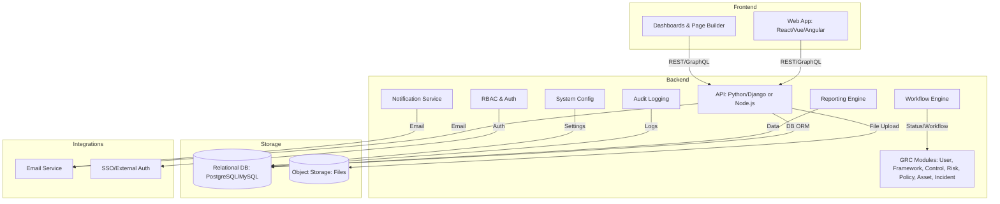
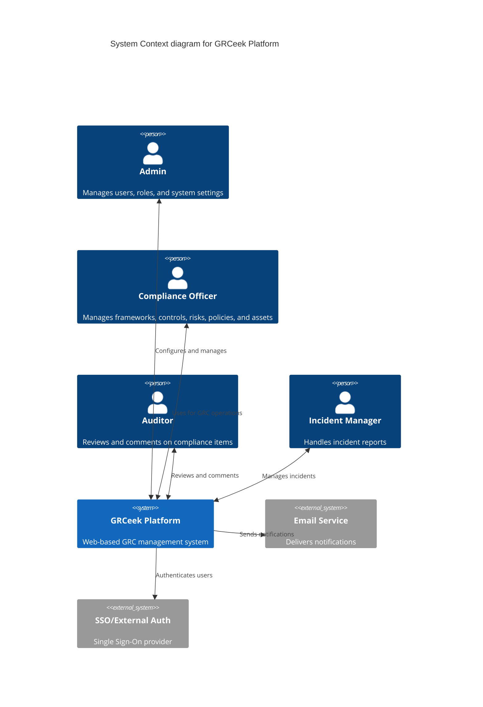
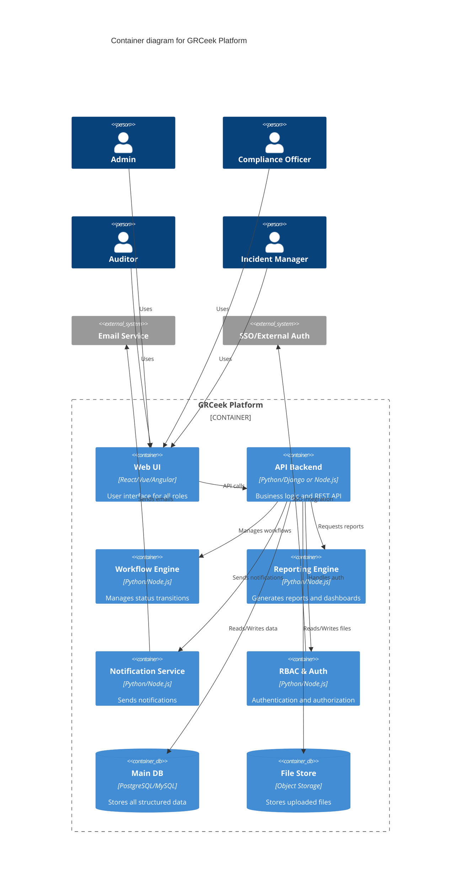
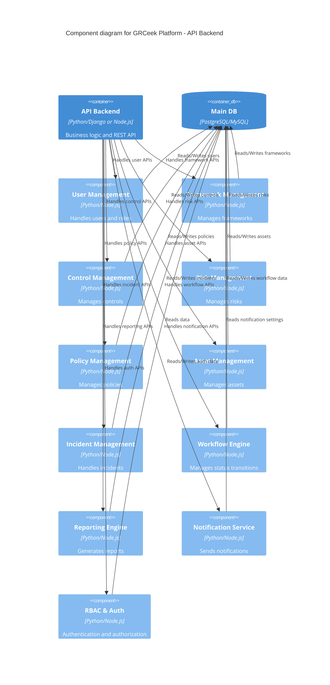

# GRCeek Project Release Scope

As part of our progress on the GRCeek project, please find below the scope for both the first release and the next release:

## First Release Scope

- User Management
- Framework Management
- Control Management
- Risk Management
- Policy Management
- Asset Management

> 📌 We kindly request the designs for the first release scope to be finalized and delivered as soon as possible to proceed with development.

## Next Release Scope

- Workflow Management
- Custom Reports
- System Configurations
- Roles & Permissions
- Incident Reporting
- Page Builder
- Notifications

---

## Requirements Summary

### Functional Requirements
- User Management with RBAC and invitation flows
- Framework, Control, Risk, Policy, and Asset Management (CRUD, linking, status workflows)
- Workflow Management (customizable, drag-and-drop)
- Custom Reports and real-time dashboards
- System Configurations (categories, settings)
- Roles & Permissions (granular, per module)
- Incident Reporting (lifecycle, evidence upload)
- Page Builder (custom UI/pages)
- Notifications (template-based, role-based, email/in-app)

### Non-Functional Requirements
- Security (encryption, RBAC, audit logging)
- Performance (<4s response, 1,000 users)
- Usability (responsive UI, accessibility)
- Availability (95% uptime, DR)
- Maintainability (clean code, docs)

---

## Epics & User Stories

### First Release Epics & User Stories

#### Epic 1: User & Access Management
- As an Admin, I want to invite or create users with roles, so that access is secure and auditable.
- As a User, I want to update my profile and change my password, so that my account is secure.

#### Epic 2: Framework, Control, Risk, Policy, and Asset Management
- As a Compliance Officer, I want to create and manage frameworks, controls, risks, policies, and assets, so that compliance is measurable and traceable.
- As a Compliance Officer, I want to link controls to frameworks, risks, and policies, so that relationships are clear.
- As an Auditor, I want to comment on frameworks, controls, and policies, so that compliance is reviewed.

#### Epic 3: Core Reporting (Basic)
- As a User, I want to view dashboards and lists for all core modules, so that I can track compliance status.

---

### Next Release Epics & User Stories

#### Epic 4: Workflow Management
- As an Admin, I want to configure custom workflows for modules, so that status transitions match our processes.

#### Epic 5: Custom Reports
- As a User, I want to generate and export custom reports, so that I can analyze compliance data as needed.

#### Epic 6: System Configurations
- As an Admin, I want to manage categories and system settings, so that the platform fits our organization.

#### Epic 7: Roles & Permissions
- As an Admin, I want to define granular permissions per module, so that access is controlled and secure.

#### Epic 8: Incident Reporting
- As a User, I want to report incidents with evidence, so that compliance issues are tracked and resolved.
- As an Incident Manager, I want to review, accept/reject, and assign incidents, so that they are resolved efficiently.

#### Epic 9: Page Builder
- As an Admin, I want to build and customize pages, so that the UI can be tailored to our needs.

#### Epic 10: Notifications
- As a User, I want to receive notifications for relevant events, so that I stay informed about important actions.

---

## Technical Tasks
- Design and implement RBAC and user invitation flows
- Build CRUD APIs for all modules (users, incidents, frameworks, risks, controls, policies, assets, categories, roles)
- Implement file upload (evidence, policy documents)
- Develop workflow engine (status transitions, drag-and-drop UI)
- Integrate notification system (template-based, role-based, email/in-app)
- Create reporting engine (real-time metrics, export)
- Implement audit logging for all actions
- Ensure encryption at rest and in transit
- Build responsive, accessible frontend
- Set up automated testing and CI/CD
- Write technical and user documentation

---

## High-Level Architecture

---

## C4 Architecture Diagrams

### 1. System Context Diagram

### 2. Container Diagram

### 3. Component Diagram (API Backend)

---

*This document summarizes the phased scope, requirements, user stories, technical tasks, and architecture for the GRCeek project.*
