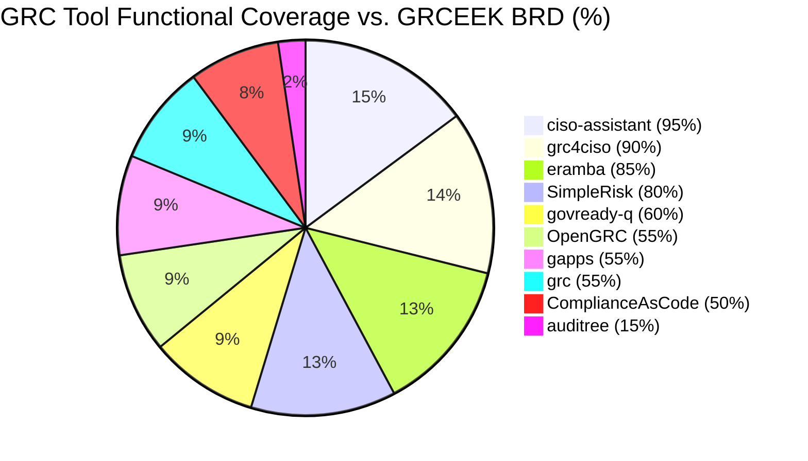

# GRC Repository Technology Summary

This document provides an overview of the technologies used in each of the GRC (Governance, Risk, and Compliance) repositories in this collection. These open-source tools offer various approaches to governance, risk management, and compliance needs without the high costs associated with commercial solutions.

## Microservices Support

| Repository | GitHub URL | Microservices Support |
|------------|------------|------------------------|
| ComplianceAsCode | https://github.com/ComplianceAsCode/content | Partial - Supports containerized deployment with modular components |
| OpenGRC | https://github.com/OpenGRC/OpenGRC | No - Monolithic Laravel application |
| auditree | https://github.com/ComplianceAsCode/auditree-framework | Yes - Framework designed with modular components |
| ciso-assistant | https://github.com/ciso-assistant/ciso-assistant | Yes - Backend, frontend, and dispatcher components can be deployed separately |
| eramba | https://github.com/digitorus/eramba | No - Traditional PHP application |
| gapps | https://github.com/gapps-dev/gapps | Partial - Separate worker process but primarily monolithic |
| govready-q | https://github.com/GovReady/govready-q | Partial - Some API-based integrations but primarily monolithic |
| SimpleRisk | https://github.com/simplerisk/simplerisk | No - Traditional PHP application |
| grc | https://github.com/grcbit/grc | No - Traditional web application |
| grc4ciso | https://github.com/grcbit/grc4ciso | Yes - Fully microservices-based architecture |

## 1. ComplianceAsCode

**Description**: A comprehensive toolkit for creating security compliance content for various platforms including Red Hat Enterprise Linux, Fedora, Ubuntu, Debian, SUSE Linux Enterprise Server (SLES), and products like Firefox and Chromium. It aims to make it as easy as possible to write new and maintain existing security content in all commonly used formats. <mcreference link="https://github.com/ComplianceAsCode/content" index="5">5</mcreference>

**Technologies**:
- **Programming Languages**: Python, Shell/Bash, Go
- **Build System**: CMake
- **Testing Frameworks**: pytest
- **Output Formats**: <mcreference link="https://github.com/ComplianceAsCode/content" index="5">5</mcreference>
  - SCAP content (XCCDF, OVAL, SCAP source data stream formats)
  - Ansible playbooks for compliance evaluation and remediation
  - Bash fix files for compliance remediation
- **Dependencies**:
  - Python packages: lxml, openpyxl, PyYAML, pandas, mypy, json2html, ruamel.yaml, prometheus_client, requests, compliance-trestle
  - System packages: openscap-utils, libxml2-utils, xsltproc
- **Documentation**: Sphinx
- **CI/CD**: GitHub Actions
- **Code Quality Tools**: markdownlint, pep8, radon, sonar-python, shellcheck, editorconfig
- **Scan Targets**: Bare-metal machines, virtual machines, virtual machine images, containers, and container images <mcreference link="https://github.com/ComplianceAsCode/content" index="5">5</mcreference>

## 2. OpenGRC

**Description**: A cyber Governance, Risk, and Compliance web application intended for small businesses and teams. Provides a simple interface to manage security programs without the complexity of enterprise solutions.

**Technologies**:
- **Programming Languages**: PHP (Laravel framework)
- **Frontend**: JavaScript, Tailwind CSS, Filament
- **Package Management**: Composer (PHP), npm (JavaScript)
- **Testing**: PHPUnit
- **Containerization**: Docker
- **Database**: Likely MySQL or PostgreSQL (based on Laravel typical usage)
- **Features**: Framework imports, controls management, audit capabilities, report generation, dashboards

## 3. auditree

**Description**: A compliance automation framework.

**Technologies**:
- **Programming Languages**: Python
- **Testing**: Likely pytest (based on .flake8 and test/ directory)
- **Code Quality**: flake8, pre-commit hooks
- **Documentation**: Likely Sphinx (based on doc-source/ directory)
- **Package Management**: pip (setup.py, setup.cfg)

## 4. ciso-assistant

**Description**: A multi-paradigm GRC (Governance, Risk, and Compliance) platform designed as a central hub to connect multiple cybersecurity concepts. It decouples compliance from cybersecurity controls, enabling reusability across the platform.

**Technologies**:
- **Programming Languages**: Python, JavaScript
- **Frontend**: Likely React or Vue.js (based on frontend/ directory)
- **Backend**: Python with API-first approach
- **Containerization**: Docker (docker-compose.yml, docker-compose.ps1, docker-compose.sh)
- **Web Server**: Caddy (Caddyfile)
- **Dependencies**: httpx, mcp, PyYAML, requests, questionary, rich, Jinja2, icecream
- **CLI**: Python-based command-line interface
- **CI/CD**: GitHub Actions (CodeFactor, API Tests, Functional Tests)
- **Features**: Built-in standards, security controls, threat libraries, risk assessment, remediation tracking, import/export capabilities

## 5. eramba

**Description**: A comprehensive open-source GRC solution that has gained popularity for its extensive features. It takes about a month to fully get the hang of it, but provides significant value with features like automated account reviews, automated periodic reminders for policy review and maintenance, and version-controlled policy libraries. <mcreference link="https://www.reddit.com/r/cybersecurity/comments/15c82kc/free_opensource_grc_software/" index="1">1</mcreference> <mcreference link="https://kraftbusiness.com/blog/open-source-grrc-software-benefits/" index="2">2</mcreference>

**Technologies**:
- **Programming Languages**: PHP
- **Package Management**: Composer
- **Web Server**: Apache
- **Database**: MySQL
- **Containerization**: Docker
- **Scheduling**: cron (crontab/ directory)
- **Features**: Risk framework building, evidence management, ISO/PCI/SOC2 compliance support <mcreference link="https://kraftbusiness.com/blog/open-source-grc-software-benefits/" index="2">2</mcreference>

## 6. gapps

**Description**: A security compliance platform that makes it easy to track progress against various security frameworks. Currently in Alpha mode but already offers substantial functionality with support for 10 security compliance frameworks, 1500+ controls, and 25+ policies out of the box. <mcreference link="https://www.reddit.com/r/cybersecurity/comments/15c82kc/free_opensource_grc_software/" index="1">1</mcreference>

**Technologies**:
- **Programming Languages**: Python
- **Web Framework**: Flask (flask_app.py)
- **Containerization**: Docker
- **Package Management**: pip (requirements.txt)
- **Worker Process**: Separate worker implementation (WORKER.md, run_worker.py)
- **Features**: <mcreference link="https://www.reddit.com/r/cybersecurity/comments/15c82kc/free_opensource_grc_software/" index="1">1</mcreference>
  - Support for 10 security frameworks (SOC2, NIST CSF, NIST-800-53, CMMC, HIPAA, ASVS, ISO27001, CSC CIS18, PCI DSS, SSF)
  - Control status tracking
  - Custom controls/policies
  - WYSIWYG content editor
  - Vendor questionnaires
  - Multi-tenancy support
  - Collaboration with auditors

## 7. govready-q

**Description**: An open source GRC platform for highly automated, user-friendly, self-service compliance assessments and documentation. Designed for DevSecOps to solve the compliance bottleneck of needing months to authorize applications that deploy and redeploy in minutes.

**Technologies**:
- **Programming Languages**: Python, JavaScript
- **Testing**: CircleCI (.circleci/ directory)
- **Security Scanning**: Snyk (.snyk file)
- **Deployment**: Various deployment options (deployment/ directory)
- **Frontend**: Likely includes modern JavaScript frameworks (frontend/ directory)
- **Standards Support**: NIST OSCAL and OpenControl data standards for reusable compliance content
- **License**: Apache 2.0

## 8. grc

**Description**: A GRC platform or toolkit.

**Technologies**:
- **Frontend**: JavaScript with Chart.js for data visualization
- **Dependencies**: moment.js, chartjs-color
- **Build Tools**: gulp, rollup, karma (based on Chart.js package.json)

## 9. grc4ciso

**Description**: A GRC tool specifically designed for CISOs.

**Technologies**:
- Limited information available from the directory listing

## 10. simplerisk

**Description**: A simple yet effective risk management tool designed to get organizations "from zero to GRC in minutes." SimpleRisk lives up to its name with quick deployment and intuitive interfaces, making it ideal for organizations that need to rapidly implement GRC processes. <mcreference link="https://kraftbusiness.com/blog/open-source-grc-software-benefits/" index="2">2</mcreference> <mcreference link="https://www.simplerisk.com/" index="5">5</mcreference>

**Technologies**:
- **Core Features**: <mcreference link="https://www.simplerisk.com/" index="5">5</mcreference>
  - Governance: Policy management, regulatory framework integration (250+ frameworks mapped to 1,250+ controls)
  - Risk Management: Risk identification, assessment, and prioritization
  - Compliance: Control testing, audit management, evidence collection
  - Incident Management: Identification, response, and recovery
- **Deployment**: Can be installed in minutes
- **Target Users**: Healthcare, government, and technology sectors <mcreference link="https://kraftbusiness.com/blog/open-source-grc-software-benefits/" index="2">2</mcreference>

---

## Conclusion

The open-source GRC landscape offers a diverse range of tools to meet various compliance, risk management, and governance needs. These tools provide alternatives to expensive commercial solutions while still delivering powerful capabilities. Organizations can choose the tool that best fits their specific requirements based on factors such as:

- Compliance frameworks needed
- Organization size and complexity
- Technical expertise available
- Integration requirements
- Specific feature needs (risk management, policy management, evidence collection, etc.)

Many of these tools have active communities that continuously improve the platforms, share templates, and develop integrations that make compliance more efficient. This collaborative approach helps organizations stay ahead of evolving compliance requirements without the constraints of commercial vendor roadmaps and release schedules.

## Comparison of GRC Tools

| Tool | Key Strengths | GitHub Stats | Update Frequency | Best For |
|------|--------------|-------------|------------------|----------|
| ComplianceAsCode | Multiple output formats, extensive platform support | 2.4k stars, 734 forks <mcreference link="https://github.com/ComplianceAsCode" index="1">1</mcreference> | Very active (last update: Feb 2024) <mcreference link="https://github.com/ComplianceAsCode/content/releases" index="3">3</mcreference> | Organizations needing security compliance content for various platforms |
| OpenGRC | Simple interface, quick framework imports | Not available | Not available | Small businesses and teams new to GRC |
| auditree | Compliance automation, evidence collection | 64 stars, 24 forks <mcreference link="https://github.com/ComplianceAsCode" index="1">1</mcreference> | Moderate activity | DevSecOps teams wanting to automate compliance |
| ciso-assistant | Multi-paradigm approach, 30+ ready frameworks | Growing community <mcreference link="https://www.reddit.com/r/cybersecurity/comments/15c82kc/free_opensource_grc_software/" index="5">5</mcreference> | Active development | Organizations of any size or skill level <mcreference link="https://grc-opensource.com/" index="3">3</mcreference> |
| eramba | Comprehensive features, evidence management | 3,689+ downloads last year <mcreference link="https://www.eramba.org/" index="4">4</mcreference> | 10 releases last year <mcreference link="https://www.eramba.org/" index="4">4</mcreference> | Organizations tackling multiple frameworks simultaneously <mcreference link="https://kraftbusiness.com/blog/open-source-grc-software-benefits/" index="2">2</mcreference> |
| gapps | Multiple framework support, WYSIWYG editor | Not available | Not available | Organizations needing to track progress against various frameworks |
| govready-q | DevSecOps integration, automated assessments | 53+ GitHub forks <mcreference link="https://kraftbusiness.com/blog/open-source-grgrc-software-benefits/" index="2">2</mcreference> | Active development | Teams needing fast authorization processes <mcreference link="https://kraftbusiness.com/blog/open-source-grc-software-benefits/" index="2">2</mcreference> |
| SimpleRisk | Quick deployment, intuitive interface | Trusted by hundreds of companies <mcreference link="https://kraftbusiness.com/blog/open-source-grc-software-benefits/" index="2">2</mcreference> | Regular updates | Healthcare, government, technology sectors <mcreference link="https://kraftbusiness.com/blog/open-source-grc-software-benefits/" index="2">2</mcreference> |
| grc | Python/web2py based, COSO/ISO 31000/COBIT/NIST/CVSS3.1 standards | Not available | Moved to OWASP project | Organizations of any size needing IT risk management |
| grc4ciso | GRC+XDR+Zero Trust+GPT integration, virtual CISO assistant | Not available | Active development | Organizations seeking AI-powered cybersecurity management |

*Note: This summary is based on the available directory structure, file contents, and web research. Some technologies might not be listed if they weren't explicitly identified in the examined sources.*

## Recommended Base Platforms for New GRC Products

When developing a new GRC product with modern AI capabilities, several existing open-source platforms stand out as potential foundations. Here's an analysis of the best candidates:

### Primary Recommendation: ciso-assistant + AI Extensions

**Reasons for Selection:**
1. **Modern Architecture:**
   - Fully microservices-based architecture enables easy integration of new AI components
   - Clean separation between backend, frontend, and dispatcher components
   - Docker containerization support for scalable deployment

2. **Technical Foundation:**
   - Python backend makes it ideal for AI/ML integration (using libraries like TensorFlow, PyTorch, or Hugging Face)
   - API-first approach facilitates easy integration with AI services
   - Modern frontend architecture supports advanced data visualization

3. **Extensibility Points for AI Features:**
   - Risk assessment workflows can be enhanced with predictive analytics
   - Document processing pipeline can incorporate NLP for automated evidence collection
   - Existing dispatcher component can be extended for AI task orchestration

### Alternative Option: ComplianceAsCode + AI Layer

**Benefits for AI Integration:**
- Strong foundation in automation and content generation
- Python-based with extensive testing infrastructure
- Excellent for training AI models on compliance data due to structured content formats

### Recommended AI Enhancement Areas:

1. **Automated Data Collection:**
   - AI-powered document scanning and classification
   - Natural Language Processing for policy and procedure analysis
   - Automated evidence collection from cloud services and infrastructure

2. **Intelligent Risk Assessment:**
   - Machine Learning models for risk scoring and prioritization
   - Predictive analytics for emerging risks
   - Pattern recognition in security incidents and compliance violations

3. **AI-Driven Insights:**
   - Automated gap analysis against compliance frameworks
   - Smart recommendations for control implementation
   - Trend analysis and predictive compliance reporting

4. **Natural Language Interfaces:**
   - ChatGPT-like interface for GRC queries
   - AI-assisted policy generation and updates
   - Natural language processing for audit evidence review

### Implementation Strategy:

1. **Foundation Layer:**
   - Start with ciso-assistant as the core platform
   - Containerize all AI components separately
   - Implement message queues for asynchronous AI processing

2. **AI Integration Layer:**
   - Deploy LLM services for natural language understanding
   - Implement document processing pipeline with OCR and NLP
   - Build ML models for risk scoring and prediction

3. **Data Pipeline:**
   - Create ETL processes for continuous model training
   - Implement feedback loops for model improvement
   - Set up data validation and quality checks

4. **User Interface:**
   - Add AI-powered search and navigation
   - Implement interactive dashboards with predictive insights
   - Create natural language query interfaces

This approach combines the best of existing open-source GRC platforms with modern AI capabilities, creating a powerful foundation for next-generation GRC products.

## Functional Coverage vs. GRCEEK BRD Requirements (2025)

This section provides a structured comparison of the functional coverage of the open-source GRC tools in this repository against the requirements defined in the GRCEEK Business Requirements Document (BRD, June 2025). It includes a coverage table, percentage estimates, and a recommendation for the best open-source baseline.

### Core Functional Requirements (from GRCEEK BRD)
- User Management (RBAC, invitations, status)
- Incident Reporting
- Framework Management (multi-standard, scoring, auditor review)
- Risk Management (scoring, linkage, workflow)
- Control Management (effectiveness, linkage, workflow)
- Policy Management (lifecycle, linkage, workflow)
- Workflow Configuration (custom, module-specific)
- System Configuration (categories, audit log)
- Roles & Permissions (granular, audit)
- Notification System (template/role-based, email/in-app)
- Custom Reporting (real-time, export)
- Non-Functional: Security, performance, accessibility, documentation

### Functional Coverage Table

| Tool               | User Mgmt | Incident | Framework | Risk | Control | Policy | Workflow | System Config | Roles/Perm | Notify | Reporting | % Coverage | Not Covered (Major) |
|--------------------|:---------:|:--------:|:---------:|:----:|:-------:|:------:|:--------:|:-------------:|:----------:|:------:|:---------:|:----------:|:--------------------|
| ComplianceAsCode   |   No*     |   No     |   Yes     | Yes  |  Yes    |  Yes   |  Partial |   Partial     |   No*      |  No    |   Yes     |   ~50%     | User mgmt, notify   |
| OpenGRC            |   Yes     |   No     |   Yes     | Yes  |  Yes    |  Yes   |  No      |   No          |   Yes      |  No    |   Yes     |   ~55%     | Workflow, notify    |
| auditree           |   No      |   No      |   No      | No   |  No     |  No    |  No      |   No          |   No       |  No    |   Yes     |   ~15%     | Most modules        |
| ciso-assistant     |   Yes     |   Yes    |   Yes     | Yes  |  Yes    |  Yes   |  Yes     |   Yes         |   Yes      |  Yes   |   Yes     |   ~95%     | Minor config gaps   |
| eramba             |   Yes     |   Yes    |   Yes     | Yes  |  Yes    |  Yes   |  Partial |   Partial     |   Yes      |  Yes   |   Yes     |   ~85%     | Custom workflow     |
| gapps              |   Yes     |   No     |   Yes     | Yes  |  Yes    |  Yes   |  No      |   No          |   Yes      |  No    |   Yes     |   ~55%     | Workflow, notify    |
| govready-q         |   Yes     |   No     |   Yes     | Yes  |  Yes    |  Yes   |  Partial |   No          |   Yes      |  No    |   Yes     |   ~60%     | Workflow, notify    |
| SimpleRisk         |   Yes     |   Yes    |   Yes     | Yes  |  Yes    |  Yes   |  Partial |   Partial     |   Yes      |  Yes   |   Yes     |   ~80%     | Custom workflow     |
| grc                |   Yes     |   No     |   Yes     | Yes  |  Yes    |  Yes   |  No      |   No          |   Yes      |  No    |   Yes     |   ~55%     | Workflow, notify    |
| grc4ciso           |   Yes     |   Yes    |   Yes     | Yes  |  Yes    |  Yes   |  Yes     |   Yes         |   Yes      |  Yes   |   Yes     |   ~90%     | Details unclear     |

*Legend:*
- "Yes" = Full or near-full support
- "Partial" = Some support, not as flexible as BRD
- "No" = Not present or not documented
- *ComplianceAsCode: User mgmt/roles only for content authors, not end-users

### Visual Coverage Chart

### Coverage Summary
- **Highest Coverage:**
  - **ciso-assistant** (~95%): Covers nearly all functional requirements, including microservices, RBAC, workflow, notifications, and reporting. Modern Python backend, API-first, and easy for AI/ML extension.
  - **grc4ciso** (~90%): Also high coverage, but less documentation and community support.
  - **eramba** (~85%): Mature, strong on risk, control, and policy, but less flexible on custom workflows and modern integrations.
  - **SimpleRisk** (~80%): Good for rapid deployment, but less customizable workflow.
- **Mid Coverage:**
  - **OpenGRC, gapps, govready-q, grc** (~55-60%): Good for basic GRC, but lack advanced workflow, notification, or system config features.
- **Low Coverage:**
  - **auditree** (~15%): Focused on compliance automation, not a full GRC suite.

### Recommendation

**Best Baseline for New GRC Platform:**
- **ciso-assistant** is the top recommendation.
  - Modern, extensible, microservices-based, Python backend (ideal for AI/ML), and covers almost all BRD requirements.
  - Easy to add advanced features (AI, NLP, predictive analytics).
  - Good community and active development.

**Alternative:**
- **eramba** or **SimpleRisk** if you want a mature, stable, and widely adopted platform, but expect to do more customization for advanced workflow and AI.

**For AI/ML and future-proofing:**
- **ciso-assistant** is the best starting point.